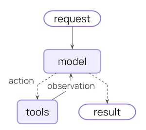

# Agent、Model 与 Tool

LangChain 的 agent 说到底就一件事：**让模型在回答之前，先有机会调工具。**

## Agent loop 到底在做什么



一个标准 agent loop 很简单：

1. 把用户输入、系统提示词、可用工具一起交给模型
2. 模型决定直接回答，还是先调用工具
3. 如果调用工具，就执行工具，把结果返回给模型
4. 模型拿到工具结果后继续判断
5. 直到它产出最终答案

这也是为什么 agent 不等于“一个 prompt”。真正麻烦的地方在循环、状态和工具反馈。

## Model：推理引擎

模型负责两件事：

- 理解当前问题和上下文
- 决定下一步该回答还是该调工具

LangChain 里常见有两种配法。

### 静态模型

最省事。创建 agent 时指定一次，后面都用它。

```python
agent = create_agent(
    model="openai:gpt-5",
    tools=[search, get_weather],
)
```

### 动态模型

运行时按复杂度、成本、轮数切换模型。长对话上大模型，简单问题走小模型，这类策略通常挂在 middleware 上。

适合：

- 成本敏感
- 想根据问题复杂度路由
- 某些节点必须用更强模型

## Tool：agent 的手和眼

工具本质上就是一个**带名称、描述和输入结构的函数**。模型不会真的“理解”你的 Python 代码，它主要靠下面三样东西来判断要不要调用：

- 工具名
- 工具描述
- 参数 schema

这也是为什么文档一直强调工具说明要写清楚。写烂了，模型就会乱调。

## 一个合格的工具长什么样

```python
from langchain.tools import tool


@tool
def search_database(query: str, limit: int = 5) -> str:
    """搜索客户数据库，返回匹配结果。"""
    return f"Found {limit} results for {query}"
```

几个硬规则：

- 参数要有类型标注
- 描述要说清用途，不要写空话
- 工具名尽量用 `snake_case`
- 一个工具只做一件事，别把一堆逻辑糊在一起

## ToolRuntime：让工具读上下文

很多工具不只是收参数，它还得知道当前用户是谁、这轮对话里发生过什么、有没有长期记忆。这时就会用到 `ToolRuntime`。

| 能力 | 说明 | 典型用途 |
|------|------|----------|
| `state` | 当前线程里的短期状态 | 读取消息历史、统计调用次数 |
| `context` | 本次运行的静态上下文 | 用户 ID、权限、环境配置 |
| `store` | 跨线程长期存储 | 用户偏好、知识条目、记忆 |
| `stream writer` | 实时写流式进度 | 长任务进度条、阶段性反馈 |

这几个东西一接进来，工具就不再只是“函数”，而变成了 agent 系统的一部分。

## `create_agent` 最常用的参数

| 参数 | 作用 | 什么时候加 |
|------|------|------------|
| `model` | 指定推理模型 | 必填 |
| `tools` | 给 agent 动作能力 | 需要外部信息或执行动作时 |
| `system_prompt` | 限定行为边界 | 几乎总该有 |
| `middleware` | 动态改 prompt、模型、工具或输出 | 需要策略控制时 |
| `response_format` | 约束最终输出结构 | 想拿稳定 JSON / schema 时 |
| `checkpointer` | 保存线程状态 | 需要多轮会话时 |

## 常见坑

- **工具太多**：模型会选错，或者为了保险瞎试。
- **工具描述太虚**：模型根本分不清每个工具什么时候用。
- **权限太大**：尤其是 SQL、文件系统、外部 API，一旦给宽了，风险不是抽象的。
- **把 agent 当工作流**：很多固定步骤任务其实更适合写成显式 workflow。
- **不做 tracing**：复杂 agent 没 trace 几乎没法查问题。

## 一条实用建议

先别急着追求“多 agent”“超复杂工作流”。绝大多数时候，**一个模型 + 一小组清晰工具 + 一个讲人话的系统提示词**，已经能解决很多问题。

能把这三样做好，后面再加 middleware、memory、LangGraph，节奏会顺很多。
