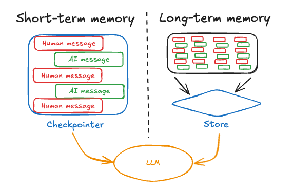

# Context Engineering 与记忆

agent 不稳定，很多时候不是模型太弱，而是**喂给模型的上下文不对**。

LangChain 文档把这件事叫 **context engineering**。说白了，就是在正确的时间，把正确的信息、工具和约束，用正确的格式交给模型。

## 为什么 agent 会跑偏

常见原因只有两个：

1. 模型本身能力不够
2. 该给模型的信息没给，或者给错了

真实项目里，第 2 类问题更常见。模型不是不知道，而是你没把它需要的东西摆到面前。

## 三类上下文

| 类型 | 生命周期 | 会不会变 | 典型内容 |
|------|----------|----------|----------|
| **Runtime Context** | 单次运行 | 不变 | 用户 ID、权限、数据库连接、环境参数 |
| **State** | 单线程 / 单会话 | 会变 | 消息历史、中间结果、工具输出 |
| **Store** | 跨线程 | 会变 | 用户偏好、长期记忆、沉淀知识 |

一个容易混淆的点：

- `runtime context` 不是“上下文窗口”
- `state` 不是长期知识库
- `store` 不是每轮都自动塞进 prompt

它们是三种不同的数据源。

## 你真正能控制的东西

LangChain 在模型调用前，主要让你控制五样东西：

| 控制项 | 作用 |
|------|------|
| **System Prompt** | 定义角色、边界、回答方式 |
| **Messages** | 给模型看的对话历史 |
| **Tools** | 让模型能做哪些动作 |
| **Model** | 控制能力、成本和风格 |
| **Response Format** | 约束最终输出结构 |

这五样东西都可以从 `context`、`state`、`store` 里取材料。

## 短期记忆：线程级状态

LangChain 的短期记忆其实是托 LangGraph 在做。你给 agent 一个 `checkpointer`，它就会把当前线程状态存下来。

```python
from langchain.agents import create_agent
from langgraph.checkpoint.memory import InMemorySaver


agent = create_agent(
    model="openai:gpt-5",
    tools=[],
    checkpointer=InMemorySaver(),
)

agent.invoke(
    {"messages": [{"role": "user", "content": "我叫 Bob"}]},
    {"configurable": {"thread_id": "thread-1"}},
)
```

关键点只有两个：

- **有 checkpointer 才有线程记忆**
- **同一个 `thread_id` 才会回到同一段会话**

## 长期记忆：别什么都塞进消息历史



消息历史适合放“这轮对话正在发生什么”。它不适合无限长，也不适合存所有稳定事实。

更稳的做法是：

- 会话内临时状态放 `state`
- 用户长期偏好放 `store`
- 真正稳定的业务知识放检索系统或外部数据库

文档里还把长期记忆分成三类：

| 类型 | 记什么 | 例子 |
|------|--------|------|
| **Semantic** | 事实 | 用户喜欢什么、某个实体的属性 |
| **Episodic** | 过去发生过的事 | agent 以前如何解决过类似问题 |
| **Procedural** | 做事规则 | prompt、few-shot、行为准则 |

## 长对话怎么处理

会话一长，两个问题就会一起冒出来：

- 超出上下文窗口
- 就算没超，模型也会被旧内容干扰

LangChain 文档给的典型处理法有三种：

### Trim

只保留最近几轮，最省事。

### Delete

把明确过期的消息从状态里删掉。

### Summarize

把旧消息压成摘要，再把摘要留在上下文里。

实际项目里，最稳的组合通常是：

- 最近几轮原文
- 更早内容摘要
- 稳定事实写入 store

## 一条很值钱的经验

别把“上下文越多越好”当默认前提。对 agent 来说，**相关、干净、可控的上下文**，比“把所有东西都扔进去”更重要。

如果模型老是做错动作，先别急着换更贵的模型。先看它到底看到了什么。
