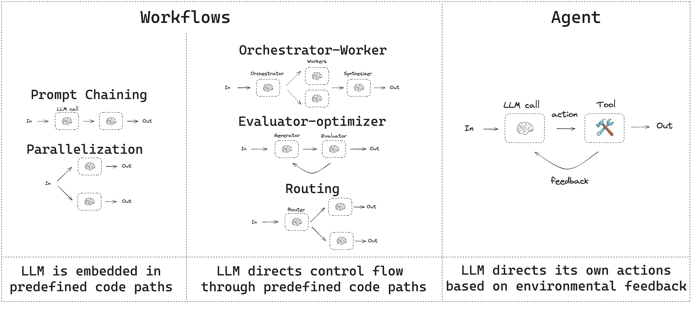

# LangGraph：定位、快速上手与工作流

LangGraph 是 LangChain 体系里的低层运行时。它不替你决定 prompt，也不替你决定 agent 架构；它主要负责一件事：**把长时间运行、有状态、可中断的 agent 稳定跑起来。**

## LangGraph 是干什么的

它关注的是 agent orchestration，也就是编排。

官方文档反复提到的几个关键词基本就是它的边界：

- **durable execution**：任务中断后能接着跑
- **streaming**：边跑边给结果
- **human-in-the-loop**：中途暂停，等人审核
- **persistence**：状态可保存、可恢复

如果 LangChain 更像“怎么写 agent”，LangGraph 更像“agent 怎么在生产环境里活下来”。

## 什么时候该直接用 LangGraph

适合：

- 你需要显式工作流，不想把流程全赌给模型
- 任务可能运行很久，甚至跨天
- 中途要暂停，等人工审批或外部系统回调
- 你想把确定性逻辑和 agent 行为混在一起

如果你只是做一个普通工具调用 agent，没必要一开始就下沉到 LangGraph。

## 最小 hello world

```python
from langgraph.graph import StateGraph, MessagesState, START, END


def mock_llm(state: MessagesState):
    return {"messages": [{"role": "ai", "content": "hello world"}]}


graph = StateGraph(MessagesState)
graph.add_node("mock_llm", mock_llm)
graph.add_edge(START, "mock_llm")
graph.add_edge("mock_llm", END)
app = graph.compile()

app.invoke({"messages": [{"role": "user", "content": "hi"}]})
```

这段代码已经把 LangGraph 的核心味道写出来了：

- 有一个共享状态 `MessagesState`
- 有节点 `mock_llm`
- 有边决定执行顺序
- 最后一定要 `compile()`

## 工作流和 agent 的区别



官方把两类系统区分得很直白：

- **Workflow**：路径基本提前写死，步骤按预定顺序跑
- **Agent**：中间会动态决定要不要调工具、走哪条路

这两个东西不是对立关系。很多真实系统都是混合的：

- 外层是确定性 workflow
- 某几个节点里嵌一个 agent

比如：

- 先做权限检查
- 再做数据准备
- 然后把分析任务交给 agent
- 最后进入人工审核节点

这类流程用 LangGraph 很顺，因为每一步都是节点。

## LangGraph 的核心价值

### 它不强行抽象你的业务

LangGraph 的节点和边本质上就是函数。你可以放模型调用，也可以放普通 Python 代码。

### 它天然适合长任务

只要配上持久化，你就能在失败、重启、中断之后继续跑，而不是从头再来。

### 它适合“半自动”系统

很多业务不是全自动才难，而是“自动跑到一半，需要人看一眼”。LangGraph 的 interrupt 机制就是为这个准备的。

## 一条实际建议

如果你已经知道自己要的是：

- 明确状态
- 明确节点
- 明确暂停点
- 明确恢复点

那就别勉强用一个高层 agent 抽象把所有问题包住。直接用 LangGraph，会更清楚。
