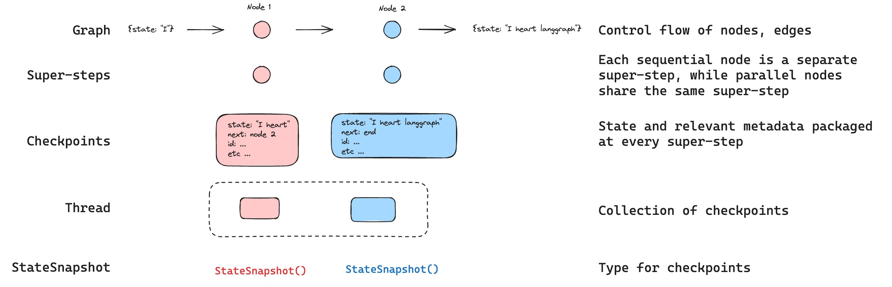

# 持久化、线程与 Checkpoint

LangGraph 真正和普通“函数编排”拉开差距的地方，是持久化。

它不是跑完就算，而是会把图的状态按步骤存下来。这样 agent 才能暂停、恢复、回放、分叉，也才能支撑长任务。

## 持久化解决了什么

官方文档列了五个主要用途：

- **human-in-the-loop**：中途停下来，等人工输入
- **memory**：同一线程里保留上下文
- **time travel**：回放旧状态，甚至从旧点分叉
- **fault tolerance**：某一步挂了，从最近成功点恢复
- **pending writes**：并行节点里已经成功的写入不用重跑

如果没有持久化，以上这些能力基本都站不住。

## Thread：状态归属的主键

LangGraph 用 `thread_id` 标识一条执行线程。你每次调用图时，必须告诉它这次属于哪个线程。

```python
config = {"configurable": {"thread_id": "thread-1"}}
app.invoke(input_data, config)
```

含义很直接：

- 用同一个 `thread_id`，就会续上之前的状态
- 换一个 `thread_id`，就相当于开新会话

## Checkpoint：每一步的快照



LangGraph 会在 **super-step** 边界保存 checkpoint。可以粗暴理解成：每完成一轮节点执行，就落一个状态快照。

所以一个简单流程：

`START -> A -> B -> END`

通常会产生多份 checkpoint：

1. 初始空状态
2. 接收到输入后的状态
3. A 跑完后的状态
4. B 跑完后的状态

这也是为什么它能从中间某一步重新开始。

## 最基本的接法

```python
from langgraph.checkpoint.memory import InMemorySaver

checkpointer = InMemorySaver()
app = builder.compile(checkpointer=checkpointer)

config = {"configurable": {"thread_id": "1"}}
app.invoke({"foo": ""}, config)
```

开发时用内存版就够。生产环境要换成真正的持久存储，比如 Postgres。

## 线程状态里一般放什么

常见有三类：

- 消息历史
- 中间产物
- 控制流程所需的标志位

比如：

- 当前卡在哪个审核节点
- 已经调用过哪些工具
- 哪个分支跑完了

一旦这些状态能稳定落盘，长任务才不会脆。

## 为什么说 checkpoint 是 LangGraph 的骨架

没有 checkpoint，很多功能都只是“看起来能做”：

- 中断后没法恢复
- 用户下次发消息接不上
- 节点失败只能从头跑
- 没法回到旧状态做调试

而有了 checkpoint，运行时就有了历史。

## 生产环境要记的几件事

### 线程 ID 要稳定

别每次现生成一个随机值，否则根本续不上。

### 开发和生产别混用存储

`InMemorySaver` 只适合本地调试。进程一停，状态就没了。

### 状态 schema 要克制

别把什么都塞进状态。状态是运行骨架，不是垃圾场。

### 先想恢复，再想执行

设计工作流时，最好先问自己：如果这里失败，下一次应该从哪一步恢复？

能回答这个问题，状态设计通常就不会太差。

## 一句话收尾

LangGraph 的持久化不是附加功能，而是它很多高级能力的前提。你可以把它看成 agent 运行时的地基。
