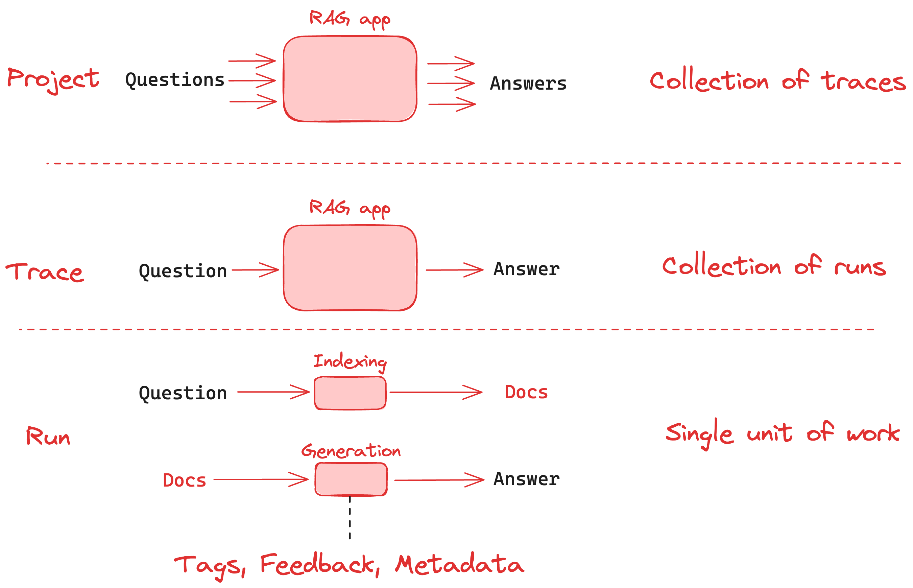

# LangSmith 总览与核心术语

LangSmith 是这套体系里最像“平台”的部分。它不要求你一定用 LangChain 或 LangGraph，官方文档一直强调它是 **framework-agnostic**。

也就是说，只要你的应用里有模型调用、工具调用、检索、工作流，LangSmith 都能接。

## LangSmith 管哪几件事

| 模块 | 作用 |
|------|------|
| **Observability** | 看 trace、查问题、做监控 |
| **Evaluation** | 跑离线/在线评测，比较不同版本 |
| **Prompt Engineering** | 管 prompt、版本、Playground、实验 |
| **Deployment** | 部署 agent，提供运行时和 Studio |
| **Fleet** | 无代码搭 agent |

如果只记一句话：

**LangSmith 负责把“开发、调试、评测、上线、回收反馈”串成一个闭环。**

## 先记住 4 个词

| 词 | 含义 |
|----|------|
| **Run** | 一次具体操作，比如一次 LLM 调用、一次检索 |
| **Trace** | 一次请求产生的整条执行链 |
| **Thread** | 多轮会话里，同一条对话的多次 trace |
| **Project** | 一组相关 trace 的容器 |

OpenTelemetry 用户可以这样类比：

- `run` 很像 span
- `trace` 就是一组 spans

## 这些概念怎么串起来

一个典型对话应用里：

1. 用户问一个问题
2. 应用开始执行，产生一条 **trace**
3. trace 里面会有多个 **run**
4. 如果这是多轮会话，这条 trace 会被挂到某个 **thread**
5. 所有这些 trace 会放在一个 **project** 里

理解了这层关系，后面看 tracing 和 evaluation 就不乱了。

## 其他常用元数据

| 项目 | 用途 |
|------|------|
| **Feedback** | 给 run 打分，人工或自动都行 |
| **Tags** | 做过滤和分组 |
| **Metadata** | 补充应用版本、环境、租户等信息 |

这些东西看着像小功能，实际很重要。没有 tags 和 metadata，线上 trace 一多就很难查。

## 官方推荐的工作流

LangSmith 首页那套思路可以压成下面这条线：

1. 本地开发
2. 打开 tracing
3. 在 UI 里看 trace 和错误
4. 把典型问题沉淀成 dataset
5. 跑 evaluation
6. 改 prompt / 模型 / 工作流
7. 部署上线
8. 持续观察线上流量，再把坏例子喂回评测

这也是它跟“单纯的 trace 平台”不一样的地方。它不是只负责看日志，而是想把 agent 的完整工程流程接住。

## 什么时候 LangSmith 最值钱

### 应用刚变复杂的时候

单次模型调用其实还好查。真正让人头疼的是：

- 多次模型调用
- 检索
- 工具调用
- 中断恢复
- 多轮会话

LangSmith 就是为这类链路准备的。

### 你开始做版本比较的时候

只靠肉眼看几个回答，很快就不够用了。要比较不同 prompt、不同模型、不同工作流，就得上评测。

### 你准备上线的时候

没 tracing、没评测、没可回放状态的 agent，很难说真的准备好了。

## 一条直白建议

LangSmith 最好不是“出了问题再接”，而是**一开始就开**。越晚接，历史数据越少，问题越难补。
