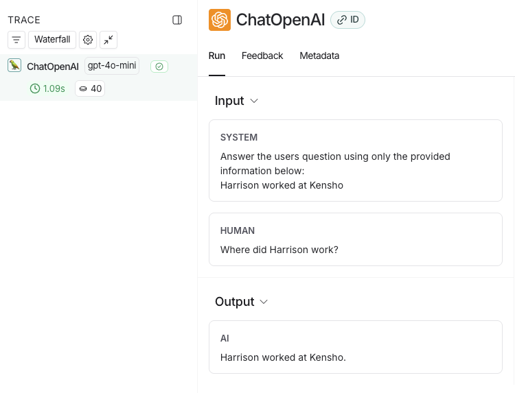

# 可观测性与 Tracing

LLM 应用和普通后端有个很烦的区别：**同样的输入，不一定给同样的输出。**

这就是为什么 LangSmith 文档把 observability 放得很前。没 trace，很多 bug 根本不是“难定位”，而是“无从定位”。

## 为什么 LLM 应用更需要 tracing

因为它的失败方式不只一种：

- prompt 传错了
- 检索没取到该取的文档
- 工具选错了
- 模型输出格式跑偏
- 多轮上下文丢了
- 成本、时延在某一步突然爆了

普通日志只能告诉你“出错了”，trace 才能告诉你“错在哪一步”。

## Tracing quickstart 最核心的配置

```bash
export LANGSMITH_TRACING=true
export LANGSMITH_API_KEY="<your-langsmith-api-key>"
export OPENAI_API_KEY="<your-openai-api-key>"
export LANGSMITH_WORKSPACE_ID="<your-workspace-id>"
```

不同模型提供商可以换，但思路不变：**开 tracing，然后把模型调用接进来。**

## 最轻量的接法：包一层模型客户端

文档里给的最短路径，是给 OpenAI 客户端套 wrapper。

```python
from openai import OpenAI
from langsmith.wrappers import wrap_openai


client = wrap_openai(OpenAI())
```

这样之后的模型调用都会自动记进 LangSmith。

## 更完整的接法：给整段应用加 trace

只包模型客户端能看到 LLM 调用，但看不到“检索 -> 组 prompt -> 调模型 -> 后处理”这整条链。

想把整个应用看全，应该用 `traceable` 之类的方式，把业务函数也包进去。

这样 trace 里就能同时看到：

- 检索
- LLM 调用
- 解析
- 工具调用
- 你的业务逻辑函数

```python
from openai import OpenAI
from langsmith import traceable
from langsmith.wrappers import wrap_openai


client = wrap_openai(OpenAI())


def retrieve(query: str) -> list[str]:
    return ["Harrison worked at Kensho"]


@traceable(name="rag_app")
def rag(question: str) -> str:
    docs = retrieve(question)
    system_prompt = "Answer only with the provided context:\n" + "\n".join(docs)
    resp = client.chat.completions.create(
        model="gpt-4.1-mini",
        messages=[
            {"role": "system", "content": system_prompt},
            {"role": "user", "content": question},
        ],
    )
    return resp.choices[0].message.content
```

## UI 里重点看什么



不是所有字段都值得盯。最值钱的通常是这几类：

| 关注点 | 用来判断什么 |
|--------|--------------|
| 输入和输出 | prompt 有没有传歪，答案是不是离谱 |
| 中间 run | 检索、工具、解析到底怎么走的 |
| 时延 | 慢在哪一步 |
| token / 成本 | 哪一步最烧钱 |
| 错误信息 | 是模型问题、工具问题，还是数据问题 |

## 项目、线程、标签怎么用

### Project

按应用或服务分。别把所有实验都丢一个 project。

### Thread

多轮对话一定要带 thread 信息，否则你只看得到一堆散 trace。

### Tags / Metadata

至少建议打这些：

- 环境：`prod` / `staging`
- 版本：`app_version`
- 模型名
- 租户 / 用户类型

后面查问题会轻松很多。

## 一条很实在的 tracing 策略

### 原型阶段

先把 tracing 打开，哪怕只记默认项目。

### 进入多人协作

补齐 project、tag、metadata 规范。

### 准备上线

把 tracing 和告警、仪表盘、在线评测连起来。

## 别把 tracing 当成“调试模式”

LangSmith 的 observability 文档其实在说另一件事：tracing 不只是排查 bug 的工具，它还是你后面做评测、做回归测试、沉淀数据集的入口。

很多线上坏例子，都是从 trace 里捞出来，最后变成 dataset 的。
